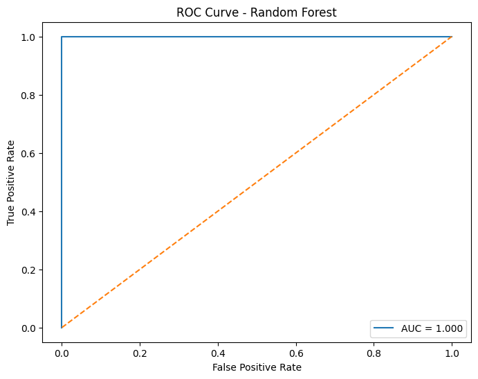
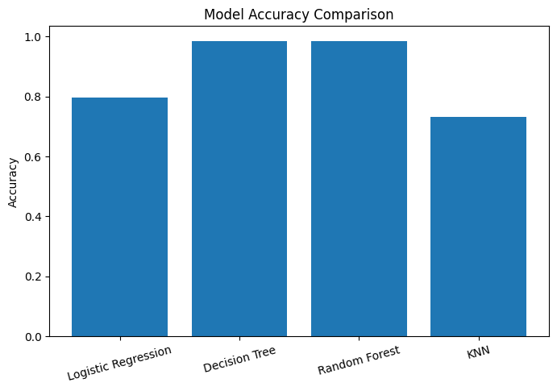
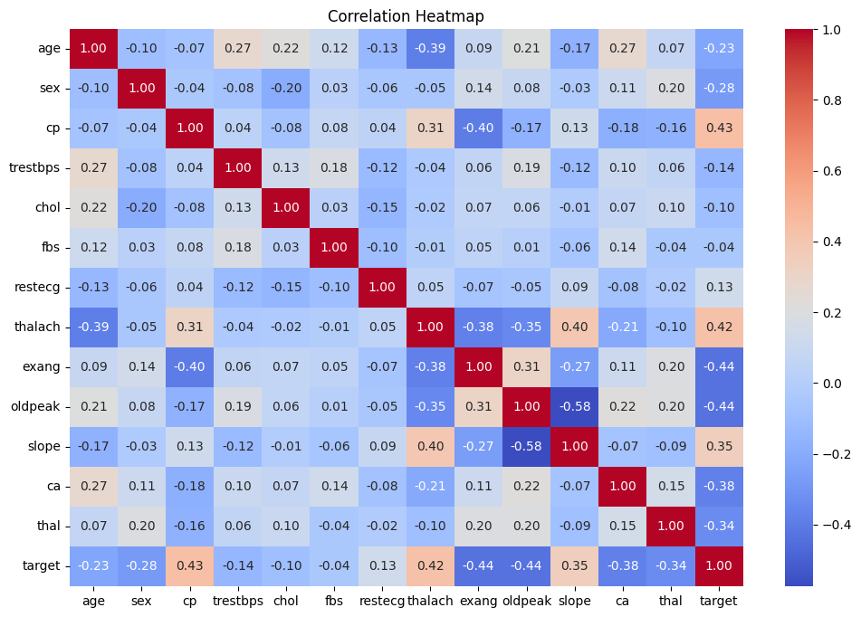

# ❤️ Heart Disease Risk Prediction using Machine Learning

## 📌 Project Overview

This project aims to predict the likelihood of heart disease using Machine Learning techniques. By analyzing patient health indicators such as age, cholesterol level, blood pressure, and heart rate, the models can assist in identifying individuals at risk of cardiovascular disease.

The project includes Exploratory Data Analysis (EDA), feature analysis, model training, performance evaluation, cross-validation, and ROC-AUC analysis.

---

## 🎯 Objectives

* Explore and understand heart disease data.
* Identify important factors associated with heart disease.
* Build predictive Machine Learning models.
* Compare model performance using multiple evaluation metrics.
* Visualize results through charts and performance curves.

---

## 📊 Dataset

Dataset: Heart Disease Dataset

Features include:

* Age
* Sex
* Chest Pain Type
* Resting Blood Pressure
* Cholesterol
* Fasting Blood Sugar
* Resting ECG
* Maximum Heart Rate Achieved
* Exercise-Induced Angina
* ST Depression
* Number of Major Vessels
* Thalassemia

Target Variable:

* 0 → No Heart Disease
* 1 → Heart Disease

---

## 🔍 Exploratory Data Analysis

Key analyses performed:

* Dataset overview
* Missing value inspection
* Statistical summary
* Feature distribution visualization
* Correlation analysis
* Target variable distribution

---

## 🤖 Machine Learning Models

The following models were implemented and evaluated:

1. Logistic Regression
2. Decision Tree
3. Random Forest
4. K-Nearest Neighbors (KNN)

---

## 📈 Model Evaluation

Evaluation techniques:

* Accuracy Score
* Cross Validation (5-Fold)
* ROC Curve
* AUC Score
* Model Comparison Visualization

---

## 📊 Results & Conclusion

The performance of multiple Machine Learning models was evaluated using Accuracy Score, 5-Fold Cross Validation, and ROC-AUC analysis.

| Model                     | Accuracy |
| ------------------------- | -------- |
| Logistic Regression       | 79.51%   |
| Decision Tree             | 98.54%   |
| Random Forest             | 98.53%   |
| K-Nearest Neighbors (KNN) | 73.17%   |

### Key Findings

* Random Forest achieved the highest predictive performance among the evaluated models.
* Cross-validation results indicated that the selected model generalized well to unseen data.
* ROC Curve and AUC analysis demonstrated strong classification capability in distinguishing patients with and without heart disease.
* Exploratory Data Analysis revealed that features such as chest pain type, maximum heart rate, ST depression, and number of major vessels showed strong relationships with heart disease outcomes.

### Conclusion

This project demonstrates a complete Machine Learning workflow for healthcare data analysis, including data preprocessing, exploratory analysis, model development, and performance evaluation.

The results indicate that Machine Learning techniques can effectively support early heart disease risk assessment and provide valuable insights for clinical decision-making. Among the tested models, Random Forest delivered the most reliable and accurate predictions, making it the preferred model for this dataset.

Future work may include hyperparameter optimization, advanced ensemble methods (e.g., XGBoost), model explainability techniques (SHAP), and deployment as a web application using Streamlit.

---

## 📈 Visual Results

### ROC Curve

### Model Comparison

### Correlation Heatmap

---

## 🛠️ Technologies Used

* Python
* Pandas
* NumPy
* Matplotlib
* Seaborn
* Scikit-Learn
* Jupyter Notebook

---

## 📂 Project Structure

heart-disease-prediction-ml/

├── data/

│ └── heart.csv

├── notebooks/

│ └── Heart_Disease_Analysis_Portfolio.ipynb

├── images/

│ ├── correlation_heatmap.png

│ ├── roc_curve.png

│ └── model_comparison.png

│ └── feature_importance.png

├── requirements.txt

└── README.md

---

## 🚀 How to Run

Clone repository:

git clone https://github.com/tntnammm/heart-disease-prediction-ml.git

Install dependencies:

pip install -r requirements.txt

Launch Jupyter Notebook:

jupyter notebook

Open:

Heart_Disease_Analysis.ipynb

---

## 📌 Future Improvements

* Hyperparameter Tuning
* Feature Engineering
* XGBoost Implementation
* Deployment using Streamlit
* Explainable AI (SHAP)

---

## 👨‍💻 Author

**Tran Nguyen Thanh Nam**

Data Science Student

GitHub:
https://github.com/tntnammm
